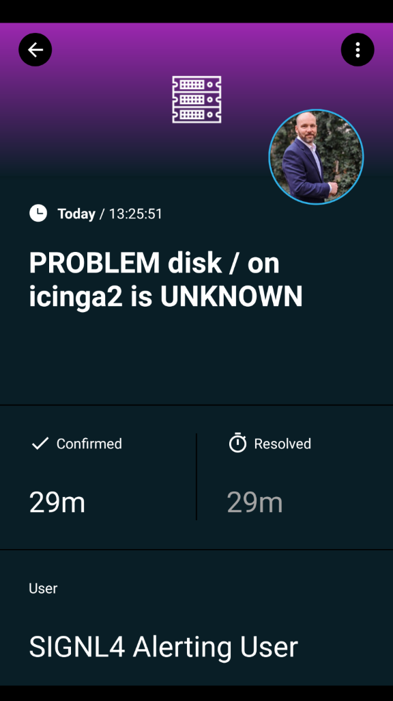

# Mobile alerting with tracking & escalation for Icinga2

## Why SIGNL4

When critical systems fail, SIGNL4 is the fastest way to alert your staff, engineers, IT admins on call and “in the field”. SIGNL4 provides reliable notifications via mobile app push, text and voice calls with tracking, escalations and duty scheduling.



Icinga2 is a monitoring tool that monitors availability and performance. It gives you simple access to relevant data. SIGNL4 enables Icinga2 to notify mobile teams in the field or on call in real-time. This speeds up their response significantly and frees resources in the operations.

Pairing Icinga2 with SIGNL4 can enhance your daily operations with an extension to your team wherever it is. The integration does not only allow you to know when a critical issue has occurred but also when it was resolved no matter where you are.

## How it Works

Icinga2 compatibility allows you to distribute operational alerts to a mobile SIGNL4 team by using a ready-made plugin. Persistent notifications and acknowledgement requirements ensure that issues will be handled before it is too late.

## Integration Capabilities

- IT staff is alerted via mobile push, SMS text and voice call
- Staff can acknowledge and take ownership for critical events that occur
- Alerts are escalated in case of no response
- Communicate within an alert to address a particular problem
- Inbound webhook or email establishes connection from Icinga2 to SIGNL4
- On-call scheduling to alert the right people at the right time

## Scenarios

- System Monitoring
- Application Monitoring
- Network Monitoring
- Database Monitoring

## Integrating SIGNL4 with Icinga2

We provide a ready-made alerting integration for Icinga2. The integration allows you to send alerts directly and automatically to your SIGNL4 team for issues detected by Icinga2.

### Prerequisites

A SIGNL4 account (https://www.signl4.com)  
An Icinga2 installation (https://icinga.com)

### Integration Steps

Below we describe the steps necessary to integrate the SIGNL4 with Icinga2.

### 1. SIGNL4 Script

On the command line, we first add the SIGNL4 send script. To do this, we download it and move it to the appropriate directory:

wget https://raw.githubusercontent.com/signl4/sign4-integration-icinga2/master/signl4-notification.sh
chmod +x signl4-notification.sh
mv signl4-notification.sh /etc/icinga2/scripts/

### 2. SIGNL4 Configuration

Now we can add the configuration file and adjust it accordingly.

wget https://raw.githubusercontent.com/signl4/sign4-integration-icinga2/master/signl4-icinga2.conf
mv signl4-icinga2.conf /etc/icinga2/conf.d/
This file contains the alarm logic and creates the user “signl4”. In this user you still have to enter your SIGNL4 team secret in the field “pager”. This is the last part of your webhook URL or the first part of your SIGNL4 email address. To do this, you have to adjust the following line accordingly.

```
pager = "team-secret"
```

### 3. Activate SIGNL4 Alerting

The file “templates.conf” in the directory “/etc/icinga2/conf.d/” contains entries “template Host” for “generic-host” and “generic-service”. Here you need to add the following line:

```
vars.enable_signl4 = true
```

This is an example:

```
template Host "generic-host" {
vars.enable_signl4 = true
}
```

```
template Host "generic-service" {
vars.enable_signl4 = true
}
```

### 4. Service Restart

Now you can restart the Icinga2 service in order to apply the changes.

```
service icinga2 restart
```

### 5. Testen it

That is it and now you can test the alert. In the simplest case you can do this manually. To do this go to your Icinga2 dashboard and there for example go to a service. On the left side under Notifications you can now send a notification. Please activate the option “Forced”. You should now receive an alert in your SIGNL4 app.

You can find additional information on GitHub at https://github.com/signl4/signl4-integration-icinga2.
